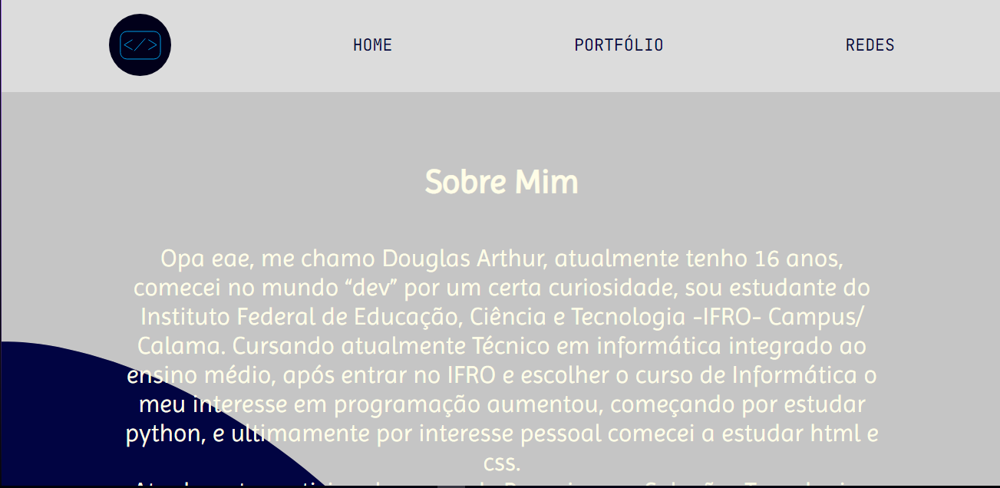
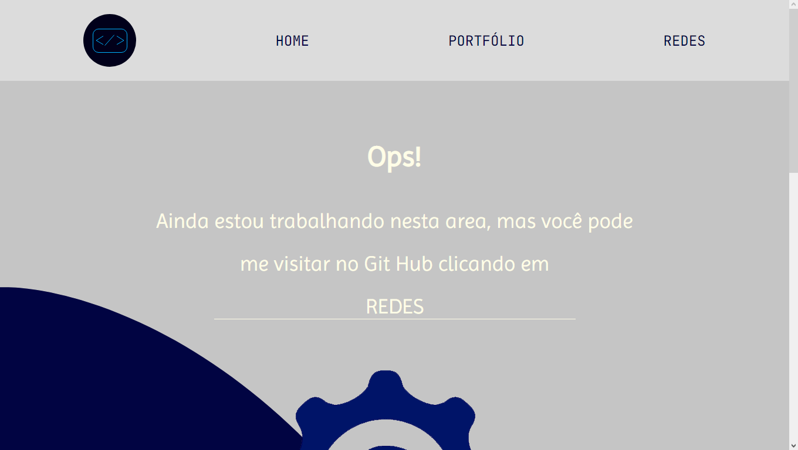
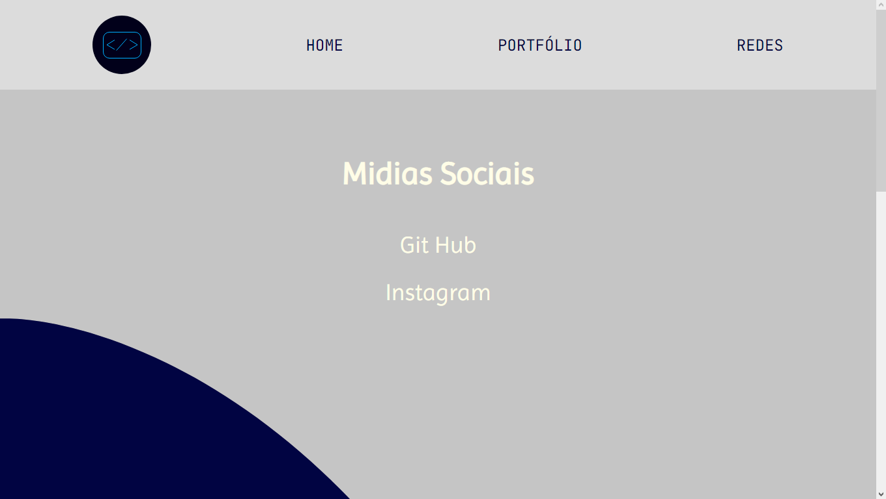
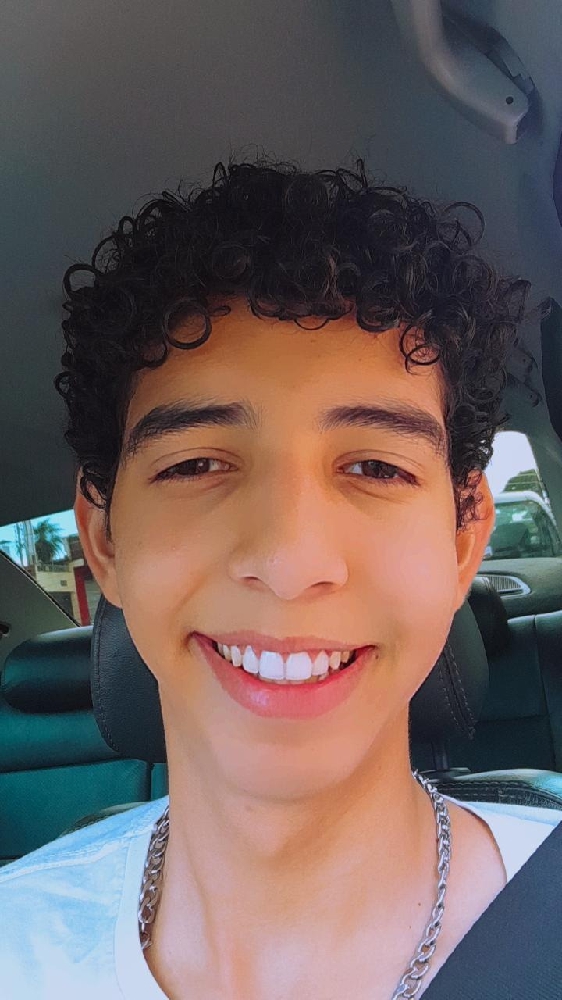

# Minha própia pagina WEB 

* ## Objetivo/ideia.
### Criar um pagina web com conhecimentos basicos em HTML E CSS, com navegação entre abas, para aprendizagem prática, e portfólio.

<html> 
    
</html>

* ## Tecnologia usada.
* ### HTML;
* ### CSS;
* ### Figma para designer.

* # Navegação entre abas

<html> 
    
</html>

# Portfólio
<html> 
    
</html>

# Redes
<html> 
    
</html>

# Link de acesso.

[PAGINA]("https://mywebtwo.netlify.app")

# Autor

<html> 
    
     
</html>

[Douglas Arthur da Silva Bento]("https://github.com/douglasarthurr")